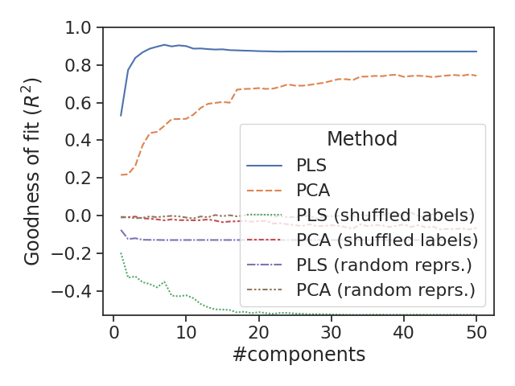
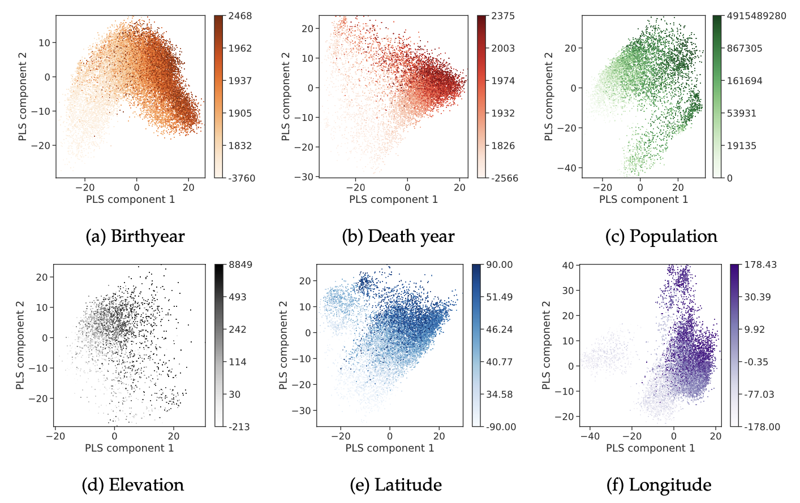
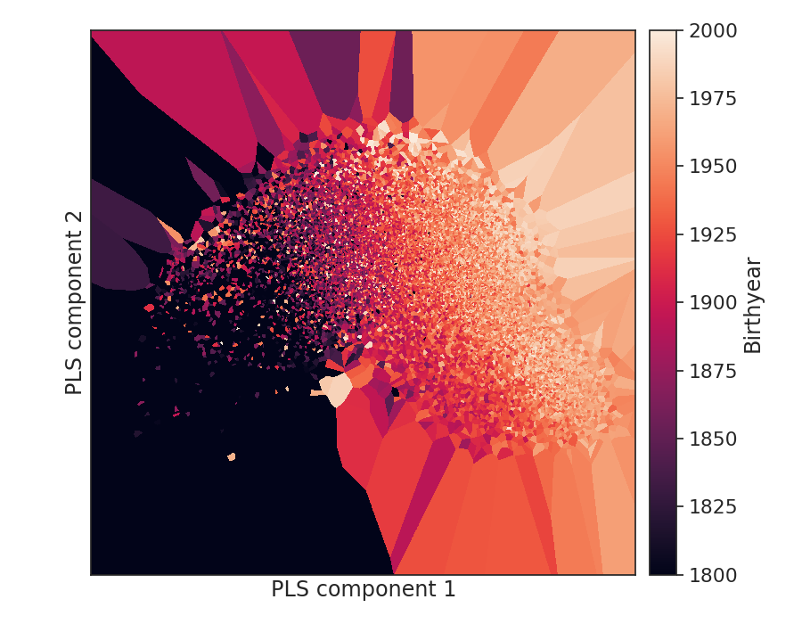
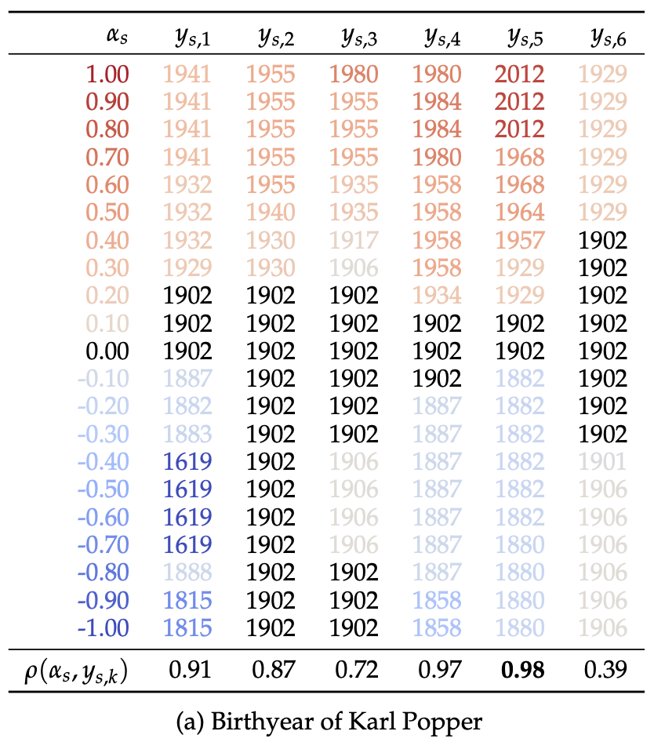

# Monotonic Representation of Numeric Properties in Language Models

This repository contains code and data for the paper: https://arxiv.org/abs/2403.10381

Table of contents:
- [Finding property-encoding directions](#finding-property-encoding-directions)
- [Plotting projections of entity representations onto the top two PLS components](#plotting-projections-of-entity-representations-onto-the-top-two-pls-components)
- [Directed activation patching](#directed-activation-patching)
- [Citation](#citation)

# Finding property-encoding directions

In section 2 of the paper, we fit partial least-squares (PLS) regression models in order to predict numeric properties of entities from their LM representations.

To replicate this experiment run:

```bash
python main.py dim_reduction \
    --numprop-train-file data/wikidata/numprop_P569.quantile_9.sample_0.train.jsonl \
    --transformer meta-llama/Llama-2-13b-hf \
    --text-enc-pooling mention_last \
    --text-enc-layer-relative 0.3 \
    --numprop-probe-target value_power \
    --numprop-dev-size 100 \
    --numprop-test-size 1000
```

This will:
1. load entity data for the Wikidata property [P569](https://www.wikidata.org/wiki/Property:P569) which is "year of birth"
2. verbalize the entity data according to a prompt template, the default is " In what year was X born?"
3. encode the prompt with a LM, here Llama-2-13B
4. select specified hidden state for each instance, in this case the hidden state corresponding to the last mention token in layer 0.3
5. fit various regression models to predict the entity's year of birth from their hidden state
6. run a sweep over the `n_components` ($k$ in the paper) parameter of PCA and PLS models
7. print the values of the best setting
8. make a plot of the sweep showing regression goodness-of-fit as a function of the number of components and save it in `out/fig`

If everyhing worked you should see output like this:
```
...
out/614ca535-9006-47dd-8d84-00808905ac7d/eval_results.md
out/fig/dim_reduction.n_components_vs_r_squared.numprop_P569.trf_Llama-2-13b-hf.mention_last_pooling.verbalizer_question.layer_None.layer_rel_0.3.target_value_power.n_components_50.png {}
out/fig/dim_reduction.n_components_vs_r_squared.numprop_P569.trf_Llama-2-13b-hf.mention_last_pooling.verbalizer_question.layer_None.layer_rel_0.3.target_value_power.n_components_50.pdf {}
Name: 13, dtype: object
2024-03-26 10:30:49| out/dim_reduction/dim_reduction.n_components_vs_r_squared.numprop_P569.trf_Llama-2-13b-hf.mention_last_pooling.verbalizer_question.layer_None.layer_rel_0.3.target_value_power.n_components_50.json
best score:
#components                       7
Goodness of fit ($R^2$)    0.906423
```

And the plot should look like this:


# Plotting projections of entity representations onto the top two PLS components

In Figure 3 of the paper we show projections of entity representations onto the top two components of PLS regressions, colored by numeric attribute values:



These can be produced with a command like the following:
```bash
python main.py plot_mention_repr \
    --transformer meta-llama/Llama-2-13b-hf \
    --numprop-train-file data/wikidata/numprop_P569.quantile_9.sample_0.train.jsonl \
    --text-enc-layer-relative 0.3 \
    --text-enc-pooling mention_last \
    --numprop-probe-target value_power
```
This should result in a several plots being saved to `out/fig`, including static plots with various color maps, [interactive bokeh plots](out/fig/mention_repr.numprop_P569.quantile_9.sample_0.train.test.n_inst_17532.verbalizer_question.Llama-2-13b-hf.mention_last_pooling.layer_12.cmap_eq_hist_True.scatter_labels_False.html), and --just for fun-- interpolations of the PLS subspace:



# Directed activation patching

To see an example of directed activation patching such as the one in Table 2 of the paper, run the following command:

```bash
python main.py patch_activations_directed \
    --transformer meta-llama/Llama-2-13b-hf \
    --numprop-train-file data/wikidata/numprop_P569.quantile_9.sample_0.train.jsonl \
    --numprop-test-size 1000 \
    --text-enc-layer-relative 0.3 \
    --text-enc-pooling mention_last \
    --edit-prompt-suffix " One word answer only: " \
    --edit-max-new-tokens 6 \
    --edit-locus-layer-left-window-size 2 \
    --edit-locus-layer-right-window-size 2 \
    --edit-locus-token-left-window-size 2 \
    --edit-locus-token-right-window-size 1 \
    --edit-locus-token-mode window \
    --n-edit-steps 21 \
    --edit-inst-split-name train \
    --edit-inst-idx 998
```

This will:
1. fit PLS regression models and select the optimal number of components $k$ on a dev set
2. for each of the $k$ components, prepare a range of directed patches
3. apply each patch to the specified patching window
4. record the raw LM output and parse a quantity, if possible

You should see output like the follwing:
```
2024-03-26 11:52:53| dir_idx: 4
0       26.82    In what year was Karl Popper born? One word answer only:       1880.\n
1       24.14    In what year was Karl Popper born? One word answer only:       1880\n In
2       21.46    In what year was Karl Popper born? One word answer only:       1880\n In
3       18.78    In what year was Karl Popper born? One word answer only:       1880\n In
4       16.09    In what year was Karl Popper born? One word answer only:       1880\n In
5       13.41    In what year was Karl Popper born? One word answer only:       1882\n In
6       10.73    In what year was Karl Popper born? One word answer only:       1882\n In
7       8.05     In what year was Karl Popper born? One word answer only:       1882\n In
8       5.36     In what year was Karl Popper born? One word answer only:       1882\n In
9       2.68     In what year was Karl Popper born? One word answer only:       1882\n In
10      0.00     In what year was Karl Popper born? One word answer only:       1902\n In
11      -2.58    In what year was Karl Popper born? One word answer only:       1902\n In
12      -5.15    In what year was Karl Popper born? One word answer only:       1929\n In
13      -7.73    In what year was Karl Popper born? One word answer only:       1929\n In
14      -10.31   In what year was Karl Popper born? One word answer only:       1954\n In
15      -12.89   In what year was Karl Popper born? One word answer only:       1964\n In
16      -15.46   In what year was Karl Popper born? One word answer only:       1968\n In
17      -18.04   In what year was Karl Popper born? One word answer only:       1968\n In
18      -20.62   In what year was Karl Popper born? One word answer only:       2012\n\n
19      -23.20   In what year was Karl Popper born? One word answer only:       2012\n\n
20      -25.77   In what year was Karl Popper born? One word answer only:       2012\n\n
```
And also a .tex file like `out/tbl/edit_effect_examples.dev.Llama-2-13b-hf.mention_last_pooling.prop_P569.inst_train_998.n_steps_21.dir_idx_all.tex` which, when rendered, shows the parsed values with a colormap applied:




# Citation

```bibtex
@misc{heinzerling2024monotonic,
    title={Monotonic Representation of Numeric Properties in Language Models}, 
    author={Benjamin Heinzerling and Kentaro Inui},
    year={2024},
    eprint={2403.10381},
    archivePrefix={arXiv},
    primaryClass={cs.CL}
}
```
